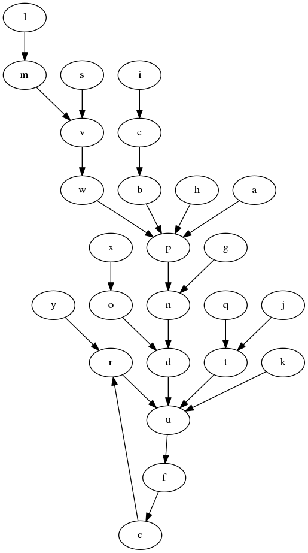

## Knowledge Representation Toolkit  

 


## Quick Start 


```
from krt import Graph
from krt.renderers import dot_render, display_graph


g = Graph.from_tuples([("a","b"),("c","d"),("c","d"),("c","b"),("d","e")])
dot_render(g)

```
 

```

from random import randint 

edges = [ (chr(n),chr(randint(ord("a"),ord("z"))))  for n  in xrange(ord("a"),ord("z")) ]

g = Graph.from_tuples(edges) 
dot_render(g) 

```

 
